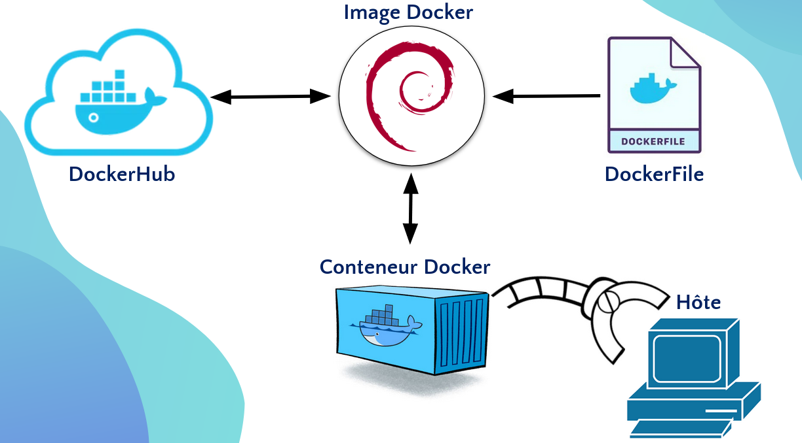
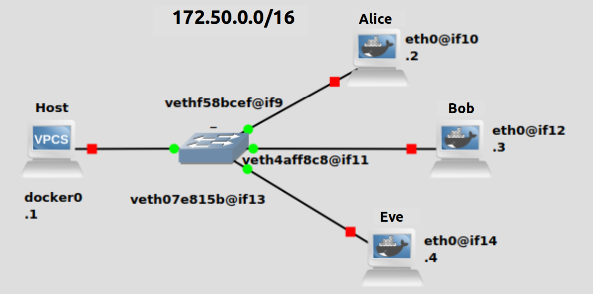
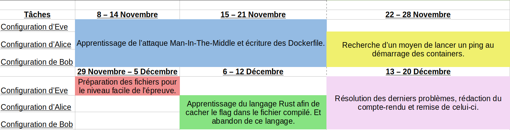
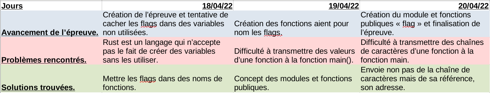

 <center><h2><ins>Compte rendu de WizzardBox, partie de Thibaut Le Goff</ins></h2></center>

**<h4><ins>Le contexte du projet :</ins></h4>**\
Dans le cadre du projet de deuxième année de DUT Réseau et Télécommunication, Vincent Font et Thibaut Le Goff ont décidé de travailler ensemble sur le projet proposé par monsieur Comby.

Ce projet consistait à la réalisation d'un site internet jouant le rôle d'une plateforme d'épreuves de type "Capture The Flag" et des épreuves qui la composent.

Une épreuve "Capture The Flag" consiste à inviter une personne à aller chercher un "flag", une suite de chiffres, lettres et/ou de caractères spéciaux, qui sont cachés dans un "endroit" en lient avec l'informatique, cet "endroit" peut être un site web, un programme informatique ou tout autres outils, ou créations, informatique.

Des lycéens ont eu l'opportunité de tester les épreuves lors de la journée portes ouvertes de l'IUT de Béziers le 5 février. Vincent et Thibaut ont aussi présenté leur projet à monsieur Comby et monsieur Cucala le 8 avril dans le cadre de la soutenance du projet.

Ce projet a été choisi, car Vincent possède un intérêt pour la cybersécurité et, car Thibaut voyait dans ce projet une utilisation concrète d'outils qu'il sera amenés à utiliser dans la licence professionnelle qu'il visse, Cloud-DevOps.

**<h4><ins>La gestion du projet :</ins></h4>**\
Afin de mettre en oeuvre ce projet, les tâches ont été divisées de la façon suivante :
- Vincent :
    A réalisé le site web, en langage de programmation Java, car il est celui qui est le plus à l'aise en programmation.
    Il a aussi réalisé quelques épreuves.

- Thibaut :
  A réalisé les épreuves.

Afin d'avoir des retours du commanditaire, des rendez-vous ont été organisés sur Discord régulièrement, avec le groupe de Théo Fabre et Grégory Fuentes.

Le projet a été, principalement, considéré par Thibaut comme étant une opportunité d’approfondir ce qui a était vue en cours et pour apprendre des concepts qui n'y ont pas était vue.

Seront donc présentées dans cette partie l'épreuve qui lui aura apportée le plus de connaissances, néanmoins les autres épreuves qu'il a créées sont disponibles sur son GitHub : https://github.com/Thibaut-Le-Goff/projet-DUT2-partie-Thibaut.

**<h4><ins>1) L'épreuve Man-In-The-Middle :</ins></h4>**\
L'épreuve Man-In-The-Middle a pour but de permettre aux participants à réaliser leur première attaque informatique, sur des conteneurs Docker, qui se nomme "Man In The Middle".

<ins>L'attaque Man-In-The-Middle :</ins>
L'attaque Man-In-The-Middle consiste à se "mettre" entre deux machines (ordinateurs, routeurs, switchs de niveau 3, etc.) afin d’intercepté les "messages", les trames, qu'ils s'envoient.

Prenons un exemple pour expliquer cette attaque :
Alice et Bob s'échangeant des trames mais Eve veut les intercepter, elle va donc envoyer en boucle des trames ARP à Alice et à Bob dans le but de fausser leurs tables ARP, cette table sert à lier l'adresse MAC d'une machine à son adresse IP dans le réseau, ces trames peuvent se résumer à :

- trames ARP envoyées à Bob : "Je donne l'adresse IP d'Alice à Bob mais avec mon adresse MAC (de Eve)."

Bob va enregistrer l'adresse IP d'Alice comme étant liée à l'adresse MAC de Eve, lorsque qu'il voudra parler à Alice et sachant que les communications dans un même réseau se font à partir des adresses MAC, il se basera sur l'adresse MAC qu'il aura associé à Alice pour communiquer, celle de Eve.
Eve recevra donc les messages que Bob souhaite envoyer à Alice.

- trames ARP envoyées à Alice : "Je donne l'adresse IP de Bob à Alice mais avec mon adresse MAC (de Eve)."

Le même processus se produit mais en inversant Alice et Bob

<ins>Les conteneurs Docker :</ins>
Les conteneurs Docker sont des sortes de petits ordinateurs virtuels qui utilisent les ressources (RAM, CPU, etc.) de l'ordinateur physique dans lequel ils sont.

Ces conteneurs Docker sont issus de ce qu'on appelle des images Dockers qui sont la source des conteneurs crée par un utilisateur, ce concept d'image Docker a été créée pour éviter à l'utilisateur de devoir a re-télécharger plusieurs kilos octets de donnée à chaque fois qu'il détruit un conteneur, la destruction d'un conteneur n'engendrera pas celle de l'image à partir duquel il a été créé.

Ces images Docker sont si petites en terme de place qu'elles peuvent être entreposées dans un site web appelé DockerHub qui répertorie une grande quantité d'image Docker.

Voici un schéma résumant tout cela :

<p align="center">
	
</p>

La décision de mettre en œuvre cette épreuve fait suite au fait que certains professeurs avaient expliqué l'attaque et que ce projet était une occasion de la pratiquer mais aussi de permettre aux autres étudiants de faire de même.

**<ins>1.1) Conception de l'épreuve :</ins>**\
L'épreuve ce déroule dans le réseau de Docker si dessous :

<p align="center">

</p>

Ce réseau se compose de trois conteneurs Docker, ils s’appellent Alice, Bob et Eve, et de l'ordinateur hôte, c'est-à-dire celui du participant.

Alice et Bob s'échangeant des trames dans lesquelles il a les flags, un que Alice envoie à Bob et un autre que Bob envoie à Alice, et le participant doit intercepter leur communication à partir de l'ordinateur de Eve.

<ins>1.1.1) Lencement de l'épreuve :</ins>

Pour lancer l'épreuve, le participant doit executer un script Bash, qui contient commandes Docker, qui sont :

```bash
docker network create --subnet 172.50.0.0/16 MITM
```

Cette commande permet de crée le réseau, nommé MITM, en lui donnant l'adresse IP 172.50.0.0 et avec un masque de sous-réseaux en /16.

```bash
docker pull ctfiutbeziers/m-alice && 
```

Cette commande permet de télécharger l'images Docker nécessaire pour créer le conteneurs d'Alice, les deux "et" commerciaux à la fin de la ligne permettent de faire en sorte que la commande suivante ne s’exécute uniquement si celle-ci s'exécute sans faire de message d’erreur, la dit commande est :

```bash
docker run --net MITM --ip 172.50.0.2 --cap-add=NET_ADMIN --name alice --hostname MITM ctfiutbeziers/m-alice &
```

Cette commande permet, à partir de l'image Docker ctfiutbeziers/m-alice, de démarrer dans le réseau MITM le conteneur d'Alice, nommée "alice", en lui donnant l'adresse IP 172.50.0.2 et en donnant à la machine, stockée dans le conteneur, le nom "MITM".

L'argument `--cap-add=NET_ADMIN` permet de donner au conteneur d'Alice la capabilitiée NET_ADMIN qui permet à Alice d'utiliser la commende iptable, qui sera vue plus tard lors de ce compte-rendue.

Les capabiltées sont des ensembles de droits du superuser, root, par exemple la capabilité CAP_DAC_OVERRIDE permet d'avoir les droits d'écriture, de lecture et d'execution de tout les dossier et fichiers.

Le "et" commercial à la fin de la ligne permet au scripte de continuer sont execution tout en poursuivent l'execution de cette commande.

Ces deux lignes du scripte ce répète ainsi pour Bob et Eve, à une exeption près :

```bash
	docker run --net MITM --ip 172.50.0.4 --cap-add=NET_ADMIN -it --name eve --hostname MITM ctfiutbeziers/m-eve
```

Contrairement aux autres commandes "docker run..." d'Alice et Bob, celle de Eve possède l'argument `-it` qui est une combinaison des arguments `-t` qui permet de crée terminal donnant accès à l'environement de Eve et de l'argument `-i` qui permet d'intéragire avec celui-ci, via le flux d'entrée stdin.

Ce script, dans sont entièreté, se trouve dans l'annexe.

<ins>1.1.2) Conception des Dockerfiles d'Alice et Bob :</ins>\
Une fois lancé, le scripte lance les conteneurs d'Alice et Bob à partir de leur image respectif.

Étant donné qu'Alice et Bob ont la même fonction, qui est d'envoyer des trames à l'autre, leur Dockerfiles est identique, hormis le nom d'utilisateur et le flag. Néanmoins, le Dockerfile de Bob se trouve dans l'annexe.

Sera donc expliqué uniquement le Dockerfile d'Alice :

```Dockerfile
FROM debian:stretch
```
Les Dockerfiles doivent avoir une base (FROM ...) afin d'être construit, ici, le Dockerfile d'Alice se base sur une distribution Debian avec la version stretch, la 9.13.

```Dockerfile
RUN apt-get update -y \
    && apt-get upgrade -y \
```

Afin que les conteneurs, issues de ce dockerfile, aient les configurations nécéssaires pour la réalisation de l'épreuve il faut installer certains paquets avec la commande `apt-get`, celle-ci doit être écrite après le mot `RUN`.

Ici, les commande ont pour but de mettre à jour le système.

```Dockerfile
    && apt-get install -y apt-utils \
    && apt-get install -y iputils-ping \
    && apt-get install -y iptables \
```

Ici les commandes effectué sont fait dans le but d'installé tout les logicielles, paquets, nécésaire pour le bon fonctionement de l'épreuve ceux-ci sont :

| Paquet  |  Utilités |
|---|---|
| apt-utils  | Pour éviter l'erreur `debconf: delaying package configuration, since apt-utils is not installed` lors du téléchargement des paquets iputils-ping et iptables. Cette erreur est cependant acceptée lors de l'exécution des commandes `apt-get update` et `apt-get upgrade` car il y a besoin de celle-ci pour éviter les érreures: `E: Package 'apt-utils' has no installation candidate`, `E: Unable to locate package apt-get`, `E: Unable to locate package update` et l'échec de la construction du conteneur.|
| iputils-ping | Pour installer la commande ping afin de pouvoir transmettre le flag à Bob. |
| iptables | Pour installer la commande iptable qui permet de filtrer les trames echo-replie, cela sera expliqué plus en détail par la suite.|

Les "`\`" servent pour faire sauter de ligne les lignes trop longues et rendre la lecture du Dockerfile plus agréable.

```Dockerfile
    && useradd -ms /bin/bash Alice
```
Cette commande sert à créer l'utilisateur Alice avec son répertoire courant, -m, et avec son shell bash, -s, se trouvant dans /bin/bash.

```Dockerfile
ADD ping.sh /ping.sh
```
Le mot `ADD` permet d'ajouter des fichiers, depuis le répertoire où se trouve le Dockerfile, aux conteneurs qui seront créés à partir du Dockerfile.

Ici le fichier sert à ping Bob dans le but de lui envoyer le flag :

```bash
#!/bin/bash

iptables -A OUTPUT -p icmp --icmp-type echo-reply -j DROP && su Alice
```

La commande iptable bloque les echo-replys afin que le participant soit obligé de faire deux arpspoof, le flag qu'Alice envoie à Bob est visible dans l'echo reply que Bob envoie à Alice si le participant ne fait qu'un arpspoof en se faisant passer pour Alice.

Ensuite, si la commande a réussi, le script que root ce log en tant qu'Alice dans le but d'éviter que le participant ne devienne root s'il décide de rentrer dans le conteneur. 

Le fait de "détourner" l'épreuve en trouvent les flags d'une autre manière qu'en réalisant l'attaque Man-In-The-Middle a été prévu, ce choix a été fait, car cela fait partie de l'esprit cyberattaque.

```bash
for (( ; ; ))
do
    ping -c 1 -p $1 172.50.0.4 > /dev/null & ping -c 1 -p $2 172.50.0.3 > /dev/null
done
```
Cette boucle for continue indéfiniment, grâce au ( ; ; ), de ping Eve (.4) dans le but de faire en sorte que le participant puisse retrouver l'adresse IP d'Alice avec la commande `ip neigh`.

Elle permet aussi de ping, aussi en boucle, Bob pour lui transmettre le flag.

Les messages contenus dans les pings sont inscrit dans des variables d'input afin d'éviter que le participant ne trouvent le flag en lissant ce fichier.

Les résultat de ces commandes sont misse dans /dev/null pour éviter de géné le participant si celui-ci décide d'entrer dans le conteneur.

```Dockerfile
RUN chmod 755 /ping.sh \
```
Cette commande permet de rendre le script exécutable.

```Dockerfile
    && echo "cd /home/Alice && su Alice" >> /home/Alice/.bashrc
```
Cette commande permet de faire en sorte que le shell du conteneur démarre dans /home/Alice/ avec l'utilisateur Alice si le participant pénètre dans le conteneur.

```Dockerfile
CMD ["./ping.sh", "202020202020202020202020", "666c61673a204d4072633020"]
```
Le mot `CMD` permet de démarrer une commande au lancement du conteneur, celle-ci est l’exécution du scripte servant à envoyer les pings avec leurs messages :

- Le premier est une suite d'espaces afin d'éviter que le participant ne le confonde au flag et pour éviter qu'une partie du flag soit visible :
```bash
root@debtiti:/home/titi/projet-DUT2-partie-Thibaut# docker container ls -a
CONTAINER ID   IMAGE                   COMMAND                  CREATED       STATUS                     PORTS     NAMES
1cafe083f01d   ctfiutbeziers/m-eve     "bash"                   2 weeks ago   Exited (0) 2 weeks ago               eve
c3110a0c2944   ctfiutbeziers/m-alice   "./ping.sh 202020202…"   2 weeks ago   Exited (137) 2 weeks ago             alice
088e754d3da4   ctfiutbeziers/m-bob     "./ping.sh 202020202…"   2 weeks ago   Exited (137) 2 weeks ago             bob
```
- Le second est le flag sous forme hexadécimal.

<ins>1.1.3) Conception des Dockerfiles de Eve :</ins>\

Le Dockerfile de Eve est construit de la façon suivante :

```Dockerfile
FROM debian:stretch
```
Tout comme celui d'Alice, le Dockerfile de Eve est basé sur Debian, avec la version stretch.

```Dockerfile
RUN apt-get update -y \
    && apt-get upgrade -y \
    && apt-get install -y apt-utils \
```

Mise à jour du système.

```Dockerfile
    # installation des paquets nécessaires à la réalisation de l'épreuve
    && apt-get install -y iproute2 \
    && apt-get install -y net-tools \
    && apt-get install -y dsniff \
    && apt-get install -y dhcpdump \
    && apt-get install -y iputils-ping \
    && apt-get install -y sudo \
    && apt-get install -y hping3 \
    && apt-get install -y tshark \
```
Installation des différents paquets :
| Paquets  |  Utilités |
|---|---|
|iproute2|Permet au participant de réaliser la commande `ip neigh` afin de connaître les adresses IP d'Alice et de Bob.|
|dsniff, dhcpdump, tshark|Différents outils pour sniffer les trames que s'échangeant Alice et Bob.|
|net-tools, iputils-ping, hping3|Pour installer les commandes `ping` et `arp` pour permettre que le participant puisse effectuer la commande `arpspoof` et ainsi permettre au participant à réaliser l'attaque Man-In-The-Middle.|
|sudo|Permet au participant de devenir super-utilisateur, root, afin d'avoir le droit d'effectuer la commande arpspoof.|

```Dockerfile
    && useradd -ms /bin/bash Eve \
```
Permet de créer l'utilisateur Eve avec son répertoire courant, -m, et avec son shell bash, -s, se trouvant dans /bin/bash.

```Dockerfile
    && echo Eve:Eve | chpasswd \
```
Cette commande permet de donner le mot de poasse "Eve" à Eve afin que le participant devienne root grace à la commande `sudo su` .

```Dockerfile
    && usermod -aG sudo Eve \
```
Ajout d'Eve dans le groupe sudo afin de faire les commandes `arpspoof` et `tcpdump`.

```Dockerfile
    && echo "clear && cat intro.txt" >> /home/Eve/.bashrc
```
Met dans le bashrc la commande `clear`, afin de nettoyer le terminal du participant lorsque celui-ci lance l'épreuve, et `cat intro.txt` afin d'afficher le message d'introduction qui est :

```bashshell
Bonjour, dans cette épreuve Alice et Bob s'échangent des pings.
Votre objectif est d'intercepter leurs messages dans lesquels il y a les flags.

/!\ Le mot de passe de Eve est "Eve". /!\
```

```Dockerfile
ADD intro.txt /home/Eve/intro.txt
```
Met le fichier contenant le texte d'intro afin que le bashrc puisse y accéder.

```Dockerfile
RUN chmod 755 /home/Eve/intro.txt
```
Donne le droit de lecture au fichier intro.txt afin que le participant puisse le relire.

```Dockerfile
USER Eve
```
Par défaut les conteneurs se lancent en tant que root, cependant le mot `USER` détermine sur quel utilisateur sera démarré le conteneur, ici c'est Eve.

```Dockerfile
WORKDIR /home/Eve
```
Le mot `WORKDIR` determine dans quell étape de l'arboréssance des fichiers sera lancé les commandes RUN, ADD et CMD, écrit dans ce Dockerfile.

```Dockerfile
CMD ["bash"]
```
Lance la commande `bash` au démarrage du conteneur afin que le participant ait accès au terminal de celui-ci.

Pour conclure cette partie, voici une chronoligie de la conception de cette épreuve :

<p align="center">
	
</p>
<ins>Notes :</ins>

- La préparation du niveau facile de l'épreuve a été abandonnée pour un système qui enlève des points (chacun des flags valent un certain nombre de points) en échange d'indices permettent de trouver les flags.
- Les codes Rust dédiés pour le niveau facile et la transmission des flags ont été abandonnés, ceux-ci se trouvent dans le GitHub de Thibaut : https://github.com/Thibaut-Le-Goff/projet-DUT2-partie-Thibaut/tree/master/MITM-training-lab-main/brouillon-code-rust.
- Afin de cacher dans des fichiers binaires les flags, il fallait utiliser un langage de programmation compilé et étant donné que les programmes à réaliser sont relativement simples et que le projet a été considérer par Thibaut comme étant une opportunité d'apprendre de nouvelles choses le langage de programmation Rust a été choisi. Mais cela était avant d'avoir trouvé la solution qui consistait à cacher les flags dans les Dockerfiles sous forme d'arguments.

**<ins>Le déroulement de l'épreuve se trouve à la partie 4, après l'annexe, de ce compte-rendu afin de ne pas dévoiler la solution celle-ci.</ins>**

**<h4><ins>2) L'épreuve text-dans-binaire :</ins></h4>**\
L'épreuve "text-dans-binaire" consiste à chercher dans un fichier binaire, issu d'un programme en Rust, trois flags.

La création de cette épreuve à était poussé par la curiosité d'appliquer ce qui à était appris au module ATW01 non pas avec des fichiers binaires issue du langage C mais issue du langage Rust.

**<ins>2.1) Conception de l'épreuve :</ins>**\
(Le programme Rust à était coupé afin de faciliter son explication, le programme complet se trouve dans l'annexe, avec les flags.)

Le fichier Rust de l'épreuve ce présente comme suit :

```rust
pub mod flag {
    [...]
}
```
Le programme commence par la déclaration (`mod`) du module "flag" qui est l'équivalent d'une librairie, un ensemble d'éléments de programmation qui ne s'exécutent seulement s'il est invoqué.

La subtilité est qu'il faut donner accès, à la fonction main, à ce module. Cela se fait en rendant public le module, grâce au mot `pub`, avant la déclaration de celui-ci.

Dans ce module se trouve, à la place de `[...]` :

```rust
    pub fn flag1_XXXX() -> &'static str {
        "Bienvenue dans l'épreuve numéro 6 !"
    }
```

`fn` indique la création de la fonction `flag1_XXXX()` qui contient la chaîne de caractère `Bienvenue dans l'épreuve numéro 6 !`.

La valeur envoyée (`->`) par cette fonction a pour type la référence (`&`) d'un string.

En Rust une référence est l'équivalent d'un pointeur en C à l’exception qu'une référence n'est utilisable, par défaut, qu'au bloc de code où elle a été créée, cela s'appelle la durée de vie.

Ici la durée de vie `'static` détermine que la référence est utilisable dans l'entièreté du programme, la valeur envoyée par cette fonction peut être utilisé dans d'autres, comme main().

Le `pub` devant la déclaration de la fonction indique que la fonction peut être utilisée dans d'autres fonctions en dehors du module, comme main(), et aussi d'autres programmes à condition que le module y soit décléré.

La fonction `flag1_XXXX()` à était nommé ainsi afin d'indiquer que c'est le premier flag, celui-ci a était remplacé par des `X` pour ne pas le montrer. Les flags sont dévoilés dans l'annexe et dans la partie du déroulement de l'épreuve.

Les autres noms de fonction ne respectent pas la même logique dans le sens qu'ils n'ont pas le schéma `flagN_<flag>`, ils sont nommés uniquement `<flag>` afin de rendre plus difficile la recherche des deux flags suivant.

```rust
fn main () {
    use std::{thread, time};
    [...]
}
```

Déclaration de la fonction `main ()` dans laquelle il est déclaré l'utilisation (`use`) des modules "thread" et "time" toutes les deux issues de la librairie standard (`std`).

Le module "thread" sert à manipuler ce qu'on appelle les threads qui sont les actions que va prendre le programme dans le même laps de temps. Un programme a par défaut un thread car il ne fait qu'une action à la fois, cependant, un programme peut faire autant d'actions à la fois que de threads qu'il possède.

Le module "time" sert à prendre toute sorte d'actions qui nécessitent une unité temporelle.

Dans cette fonction main, il y a :
```rust
    println!("{}", flag::flag1_XXXX());
```
Écrit ce qui est stocké dans la fonction flag1_XXXX qui est elle-même stocké dans le module flag.

```rust
    thread::sleep(time::Duration::from_secs(2));
```
Cette ligne sert à stopper l'avancement du fil d'instruction, thread, du code pendant deux secondes. Elle est structurée comme suit :

| Code  |  explication |
|---|---|
|`thread::sleep( [...] )`|Cherche la fonction `sleep()` dans la librairie `thread`. La fonction `sleep()` sert à stopper un thread pour une durée à déterminer entre les parenthèses.|
|`time::Duration::from_secs(2)`|Cherche la fonction `from_secs()`, qui sert à spécifier une durée en terme de secondes, dans le module `Duration` qui se trouve dans la librairie `time`.|

Voici un tableau montrant le déroulement de la conception de l'épreuve :

<p align="center">
	
</p>

Note : Pour que l'épreuve soit réalisable, le fichier epreuve6-text-dans-binaire.rs doit être compilé comme suit :
```bashshell
rustc -g epreuve6-text-dans-binaire.rs
```

**<ins>Le déroulement de l'épreuve se trouve à la partie 4, après l'annexe, de ce compte-rendu afin de ne pas dévoiler la solution celle-ci.</ins>**

**<h4><ins>3) Annexe :</ins></h4>**\
<ins>1.1.1) Script de lancement de l'épreuve Man-In-The-Middle  :</ins>

```bash
#!/bin/bash

docker network create --subnet 172.50.0.0/16 MITM

	docker pull ctfiutbeziers/m-alice && 
	docker run --net MITM --ip 172.50.0.2 --cap-add=NET_ADMIN --name alice --hostname MITM ctfiutbeziers/m-alice &

docker pull ctfiutbeziers/m-bob && 
	docker run --net MITM --ip 172.50.0.3 --cap-add=NET_ADMIN --name bob --hostname MITM ctfiutbeziers/m-bob &

docker pull ctfiutbeziers/m-eve && 
	docker run --net MITM --ip 172.50.0.4 --cap-add=NET_ADMIN -it --name eve --hostname MITM ctfiutbeziers/m-eve
```

<ins>1.1.2) Le Dockerfile d'Alice :</ins>

```Dockerfile
FROM debian:stretch

RUN apt-get update -y \
    && apt-get upgrade -y \
    && apt-get install -y apt-utils \
    && apt-get install -y iputils-ping \
    && apt-get install -y iptables \
    && useradd -ms /bin/bash Alice

ADD ping.sh /ping.sh
RUN chmod 755 /ping.sh \
    && echo "cd /home/Alice && su Alice" >> /home/Alice/.bashrc

CMD ["./ping.sh", "202020202020202020202020", "666c61673a204d4072633020"]
```

<ins>1.1.2) Le script qui permet à Alice de pinger Bob afin de lui transmettre le flag :</ins>

```bash
#!/bin/bash

iptables -A OUTPUT -p icmp --icmp-type echo-reply -j DROP && su Alice

for (( ; ; ))
do
    ping -c 1 -p $1 172.50.0.4 > /dev/null & ping -c 1 -p $2 172.50.0.3 > /dev/null
done
```

<ins>1.1.2) Le Dockerfile de Bob :</ins>

```Dockerfile
FROM debian:stretch

RUN apt-get update -y \
    && apt-get upgrade -y \

    && apt-get install -y apt-utils \
    && apt-get install -y iputils-ping \
    && apt-get install -y iptables \
    && useradd -ms /bin/bash Bob

ADD ping.sh /ping.sh
RUN chmod 755 /ping.sh \

    && echo "cd /home/Alice && su Bob" >> /home/Bob/.bashrc

CMD ["./ping.sh", "202020202020202020202020", "464c41473a205028297c4f20"]
```

<ins>1.1.2) Le script qui permet à Bob de pinger Alice afin de lui transmettre le flag :</ins>

```bash
#!/bin/bash

iptables -A OUTPUT -p icmp --icmp-type echo-reply -j DROP && su Bob

for (( ; ; ))
do
        ping -c 1 -p $1 172.17.0.4 > /dev/null & ping -c 1 -p $2 172.17.0.2 > /dev/null
done
```

<ins>1.1.3) Le Dockerfiles de Eve :</ins>

```Dockerfile
FROM debian:stretch

RUN apt-get update -y \
    && apt-get upgrade -y \
    && apt-get install -y apt-utils \
    && apt-get install -y iproute2 \
    && apt-get install -y net-tools \
    && apt-get install -y dsniff \
    && apt-get install -y dhcpdump \
    && apt-get install -y iputils-ping \
    && apt-get install -y sudo \
    && apt-get install -y hping3 \
    && apt-get install -y tshark \
    && useradd -ms /bin/bash Eve \
    && echo Eve:Eve | chpasswd \
    && usermod -aG sudo Eve \
    && echo "clear && cat intro.txt" >> /home/Eve/.bashrc

ADD intro.txt /home/Eve/intro.txt
RUN chmod 755 /home/Eve/intro.txt

USER Eve
WORKDIR /home/Eve

CMD ["bash"]
```
<ins>1.1.3) Le message d'introduction (intro.txt) :</ins>

```bashshell
Bonjour, dans cette épreuve Alice et Bob s'échangent des pings.
Votre objectif est d'intercepter leurs messages dans lesquels il y a les flags.

/!\ Le mot de passe de Eve est "Eve". /!\
```
<ins>2.1) Le programe de l'épreuve text-dans-binaire :</ins>

```rust
pub mod flag {

    pub fn flag1_c3st() -> &'static str {
        "Bienvenue dans l'épreuve numéro 6 !"
    }

    pub fn c0ol() -> &'static str {
        "Cette épreuve consiste à chercher les trois différents flags qui se cachent dans ce fichier binaire."
    }

    pub fn rvs1() -> &'static str {
        "Chacun des flags valent un point et sont composés d'un chiffre et de trois lettres... Bonne chance !"
    }
}

fn main () {
    use std::{thread, time};

    println!("{}", flag::flag1_c3st());
    thread::sleep(time::Duration::from_secs(2)); 

    println!("{}", flag::c0ol());
    thread::sleep(time::Duration::from_secs(4));

    println!("{}", flag::rvs1());
    thread::sleep(time::Duration::from_secs(4));
}
```

**<h4><ins>4) Déroulement, et solutions, des épreuves :</ins></h4>**

<ins>4.1) Déroulement de l'épreuve Man-In-The-Middle :</ins>\
Pour lancer l'épreuve, le participant doit lancer le script écrit pour cela :
```bashshell
root@debtiti:/home/titi/projet-DUT2-partie-Thibaut# ./epreuve2-MITM.sh 
```
Une fois cela fait, le participant arrive sur le terminal de Eve avec le message d'introduction :
```bashshell
Bonjour, dans cette épreuve Alice et Bob s'échangent des pings.
Votre objectif est d'intercepter leurs messages dans lesquels il y a les flags.

/!\ Le mot de passe de Eve est "Eve". /!\

Eve@MITM:~$ 
```
Pour effectuer l'attaque man-in-the-middle le participant doit savoir les adresse IP d'Alice et Bob, il peut le faire comme suit :
```bashshell
Eve@MITM:~$ ip neigh
172.50.0.2 dev eth0 lladdr 02:42:ac:32:00:02 REACHABLE
172.50.0.3 dev eth0 lladdr 02:42:ac:32:00:03 REACHABLE
Eve@MITM:~$ 
```
Maintenant que le participant les connaît, il doit devenir root : 
```bashshell
Eve@MITM:~$ sudo su

We trust you have received the usual lecture from the local System
Administrator. It usually boils down to these three things:

    #1) Respect the privacy of others.
    #2) Think before you type.
    #3) With great power comes great responsibility.

[sudo] password for Eve: 
root@MITM:/home/Eve# 
```
Le participant étant root peut commencer l'attaque :
```bashshell
root@MITM:/home/Eve# arpspoof -t 172.50.0.2 172.50.0.3 2>1 &
[1] 21
root@MITM:/home/Eve#
```
L'explication de cette commande sera faite sous forme d'un tableau :
| Partie de la commande  |  explication |
|---|---|
|arpspoof|La commande qui consiste à envoyer des trame arp avec le choix de l'adresse IP source et destination.|
|-t| -t pour target, l'adresse IP qui suit est celle de la personne à qui le participant veut fausser la table ARP|
|172.50.0.2|L'adresse IP mentionné juste au-dessus, celle d'Alice, cette commande aura donc effet sur la table ARP d'Alice. C'est l'adresse IP de la destination.|
|172.50.0.3|Adresse IP de la source, présumé par Alice, qui est celle de Bob.|
|2>1|Redirige les informations du flux stderr vers le flux stdin. Sans cela la commande donne la réponse : `2:42:ac:32:0:4 2:42:ac:32:0:2 0806 42: arp reply 172.50.0.3 is-at 2:42:ac:32:0:4` or cela n'a pas l'air d'être un message d'erreur car le `arp reply 172.50.0.3 is-at 2:42:ac:32:0:4` indique bien que l'adresse 172.50.0.3 (Bob) est liée à l'adresse MAC de Eve, ce qui est voulue.|
|&|Fait en sorte que la commande se déroule en arrière-plan.|

Une fois cela fait, le participant peut lire les trames qu'Alice souhaite envoyer à Bob :

```bashshell
root@MITM:/home/Eve# tcpdump icmp -X
tcpdump: verbose output suppressed, use -v or -vv for full protocol decode
listening on eth0, link-type EN10MB (Ethernet), capture size 262144 bytes
[...]                              ....
20:34:24.473822 IP alice.MITM > bob.MITM: ICMP echo request, id 1602, seq 1, length 64
	0x0000:  4500 0054 6bec 4000 4001 7653 ac32 0002  E..Tk.@.@.vS.2..
	0x0010:  ac32 0003 0800 1df9 0642 0001 509e 8a62  .2.......B..P..b
	0x0020:  0000 0000 953a 0700 0000 0000 3a20 4d40  .....:......:.M@
	0x0030:  7263 3020 666c 6167 3a20 4d40 7263 3020  rc0.flag:.M@rc0.
	0x0040:  666c 6167 3a20 4d40 7263 3020 666c 6167  flag:.M@rc0.flag
	0x0050:  3a20 4d40                                :.M@
[...]
```
Ici le flag qu'envoie Alice est `M@rc0`.

Pour connaître le flag qu'envoie Bob à Alice, le participant doit réaliser la même commande arpspoof mais en inversant les adresses IP de Bob et Alice :

```bashshell
root@MITM:/home/Eve# arpspoof -t 172.50.0.3 172.50.0.2 2>1 &
[2] 23
root@MITM:/home/Eve# 
root@MITM:/home/Eve# tcpdump icmp -X
tcpdump: verbose output suppressed, use -v or -vv for full protocol decode
listening on eth0, link-type EN10MB (Ethernet), capture size 262144 bytes
[...]                               ....
20:41:34.968546 IP bob.MITM > alice.MITM: ICMP echo request, id 1776, seq 1, length 64
	0x0000:  4500 0054 fff1 4000 4001 e24d ac32 0003  E..T..@.@..M.2..
	0x0010:  ac32 0002 0800 1293 06f0 0001 fe9f 8a62  .2.............b
	0x0020:  0000 0000 1dc7 0e00 0000 0000 3a20 5028  ............:.P(
	0x0030:  297c 4f20 464c 4147 3a20 5028 297c 4f20  )|O.FLAG:.P()|O.
	0x0040:  464c 4147 3a20 5028 297c 4f20 464c 4147  FLAG:.P()|O.FLAG
	0x0050:  3a20 5028                                :.P(
[...]
```
Le flag qu'envoie Bob est `P()|O`.

<ins>4.2) Déroulement de l'épreuve text-dans-binaire :</ins>\
Pour débuter l'épreuve, le participant doit éxécuter le fichier epreuve6-text-dans-binaire :

```bashshell
root@debtiti:/home/titi/projet-DUT2-partie-Thibaut# ./epreuve6-text-dans-binaire
Bienvenue dans l'épreuve numéro 6 !
Cette épreuve consiste à chercher les trois différents flags qui se cachent dans ce fichier binaire.
Chacun des flags valent un point et sont composés d'un chiffre et de trois lettres... Bonne chance !
root@debtiti:/home/titi/projet-DUT2-partie-Thibaut# 
```
Une des solutions à l'épreuve est d'utiliser la commande `objdump` :

```bashshell
titi@debtiti:~/projet-DUT2-partie-Thibaut$ objdump -g ./epreuve6-text-dans-binaire | less
```
Le participant pourra chercher le flag avec `/flag` :
```bashshell
    <626>   DW_AT_linkage_name: (chaîne indirecte, décalage: 0x8b3): _ZN26epreuve6_text_dans_binaire4flag10flag1_c3st17h286bade57852d45bE
    <62a>   DW_AT_name        : (chaîne indirecte, décalage: 0x8f8): flag1_c3st
[...] 
    <643>   DW_AT_linkage_name: (chaîne indirecte, décalage: 0x90c): _ZN26epreuve6_text_dans_binaire4flag4c0ol17hd0954afbd456b997E
    <647>   DW_AT_name        : (chaîne indirecte, décalage: 0x94a): c0ol
[...]
    <660>   DW_AT_linkage_name: (chaîne indirecte, décalage: 0x94f): _ZN26epreuve6_text_dans_binaire4flag4rvs117h72a5f649d69e3a57E
    <664>   DW_AT_name        : (chaîne indirecte, décalage: 0x98d): rvs1
```

Les trois flags de l'épreuve sont :
- `c3st`
- `c0ol`
- `rvs1`
